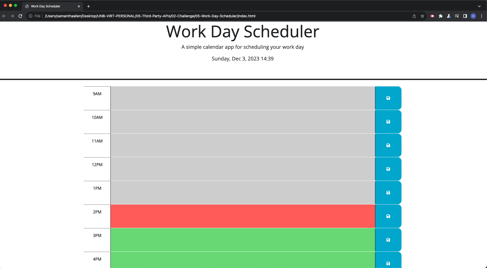
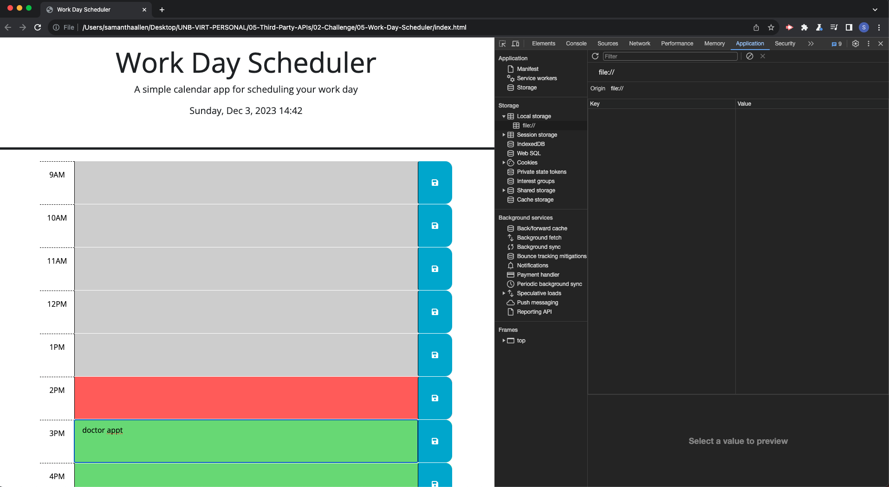
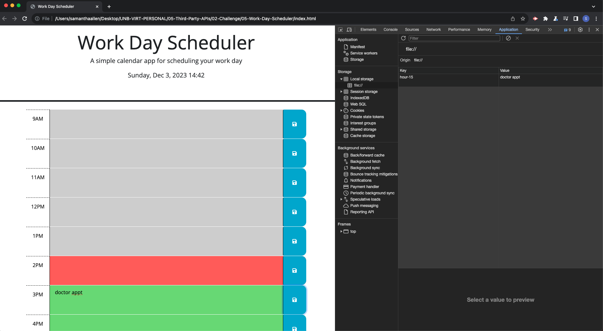
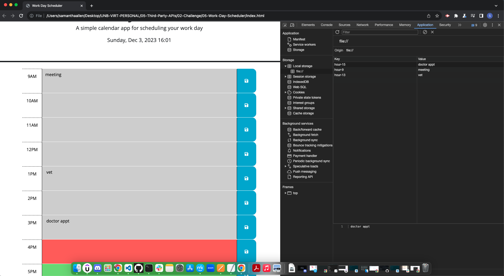

# 05-Work-Day-Scheduler

## Description

Live URL 👇🏼 

My motivation was simply to solidify my understanding of Jquery and to practice my Javascript. I build this project to also practice using dayjs. I want to fully understand everything that I am coding. I learned that in order to be good at jquery, you must have a solid understanding of Javascript.

## Installation

N/A

## Usage

To start the Day Planner will look like this. Depending on the current time of day, the time blocks may vary in color. In the image below, the current time was 2:39PM. This shows the time blocks prior are grayed out as they are in the past. The current 2PM time block is red as it is the current hour and every hour after is green as its in the future. The planner only shows 9AM to 5PM business hours. 
 
 
 
In each empty space to the right of the time is a text area where you can important appointments/important info. 
 
 
 
The save button on the right will save what you inputted in the text area to local storage. 
 
 
 
The day planner is set to reload the page every minute to keep the time at the top of the page current. It also shows todays date & day of the week. Once the page reloads, anything saved in the text area will stay as the javascript includes an iteration for each time block to get the values from local storage if there is any. 
 
 
 

## Credits
I referred to class material as much as possible. Thank you to my tutor Andrew for helping me with my issues regarding getting the values from local storage. Thank you to Morgan, the askBCS learning assistannt for assisting with splitting the HOUR ID attributes as I was stumped.

https://learn.jquery.com/using-jquery-core/document-ready/
https://www.w3schools.com/jquery/jquery_traversing_siblings.asp
https://www.w3schools.com/jquery/tryit.asp?filename=tryjquery_siblings
https://stackoverflow.com/questions/40791207/setting-and-getting-localstorage-with-jquery
https://developer.mozilla.org/en-US/docs/Web/JavaScript/Reference/Global_Objects/NaN
https://developer.mozilla.org/en-US/docs/Web/JavaScript/Reference/Global_Objects/parseInt
https://developer.mozilla.org/en-US/docs/Web/JavaScript/Reference/Global_Objects/String/split

## License

The MIT License is short and to the point. It lets people do almost anything they want with your project, like making and distributing closed source versions.

## Badges

N/A

## Features

N/A

## How to Contribute

N/A

## Tests

Test out the day planner & save your appointments!